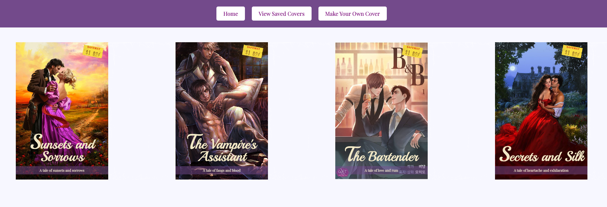

# RomCom  

### Abstract:
There's not enough romance novels in the world! We have created a random generator webapp to satisfy this market need. 
#### Features:
- Have a romance novel cover idea? No problem! Just go to the "Make Your Own Cover" page and fill out the form!
- No creative ideas? Just hit the "Show Random Cover" button!
- Like the cover you generated? Just hit the "Save Cover" button and view all your romance novel dreams by clicking the "View Saved Covers" button!
- Almost like what you see? You can edit each individual element (cover, title, tagline) by clicking and editing in your own ideas!

### Installation Instructions:
Interested in developing more on this webapp? Here are the steps to get started:
1. Go to your terminal and `git clone git@github.com:CaliHam/romcom.git`
2. Open the webapp locally by `open index.html`

### Preview of App:
 

### Context:
We had 5 days to complete this project. We are in the Turing Front End Module 1, Cohort 2303. We completed one iteration per day, which left time for refactoring and adding extra features on the last day.

### Contributors:
- [Calli](https://github.com/CaliHam)
- [Matt](https://github.com/mbenfowler)

### Learning Goals:
[//]: <> (What were the learning goals of this project? What tech did you work with?)
1. Write clean, DRY JavaScript
    - Build out functionality using functions that show trends toward SRP and purity
    - Manipulate the page after it has loaded adding, removing, and updating elements on the DOM
2. Explore the connection between HTML, CSS, and JavaScript
    - Practice reading, understanding, and using provided code
3. Write code collaboratively
    - Document changes with atomic commits & thorough code reviews
    - Communicate, troubleshoot, and plan effectively as a team
    - Ensure all team members are able to be heard and contribute throughout the project

### Wins + Challenges:
[//]: <> (What are 2-3 wins you have from this project? What were some challenges you faced - and how did you get over them?)
#### Wins:
1. IT WORKS!!!!!!
2. Communication - as partners, we communicated our time availablity and stuck to our norming contract.
3. Project grooming - making tickets and prioritizing.

#### Challenges:
1. Merge Conflicts - new concept that we walked through together to ensure successful resolution.
2. Balancing time between writing code, refactoring, and learning new concepts entirely (.innerHTML, try...catch, prompt, .tagName, new URL(), event.preventDefault()).
