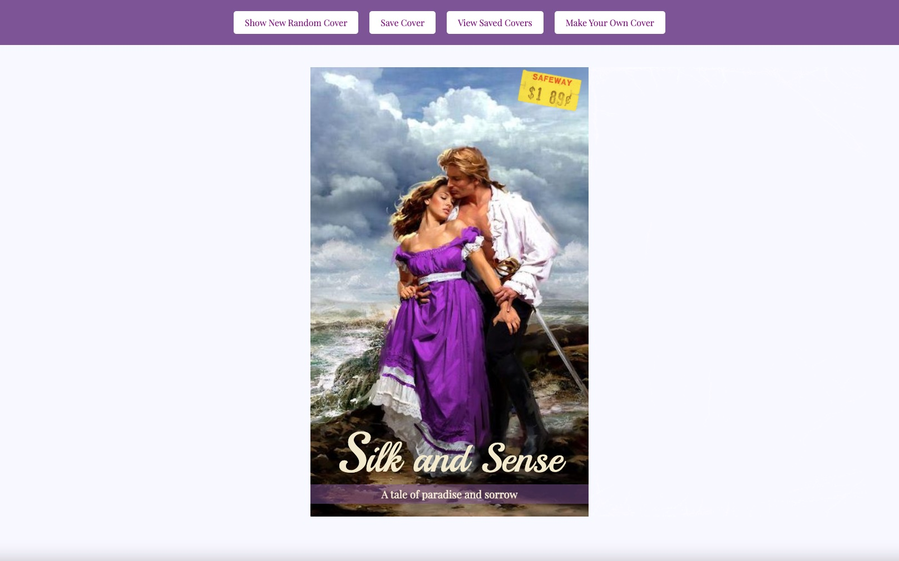
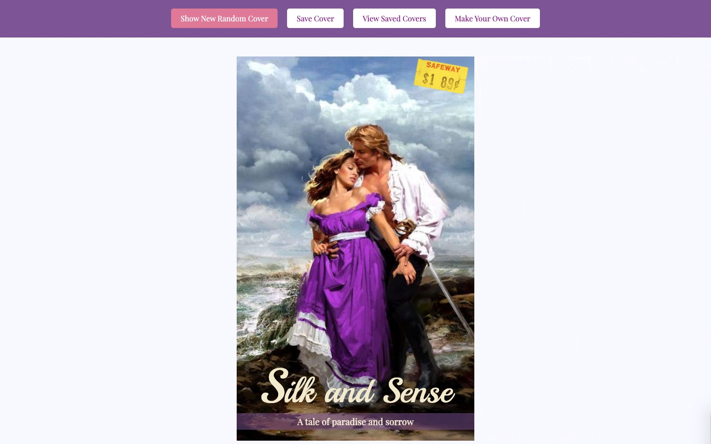
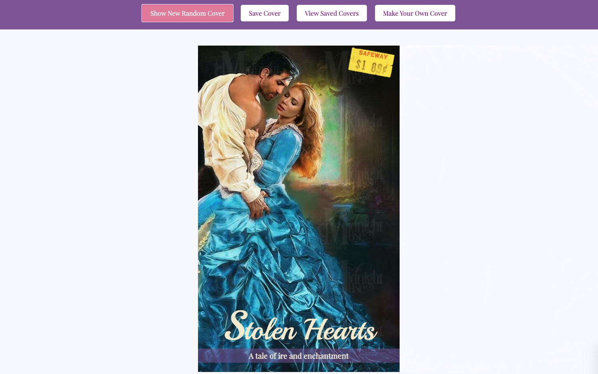
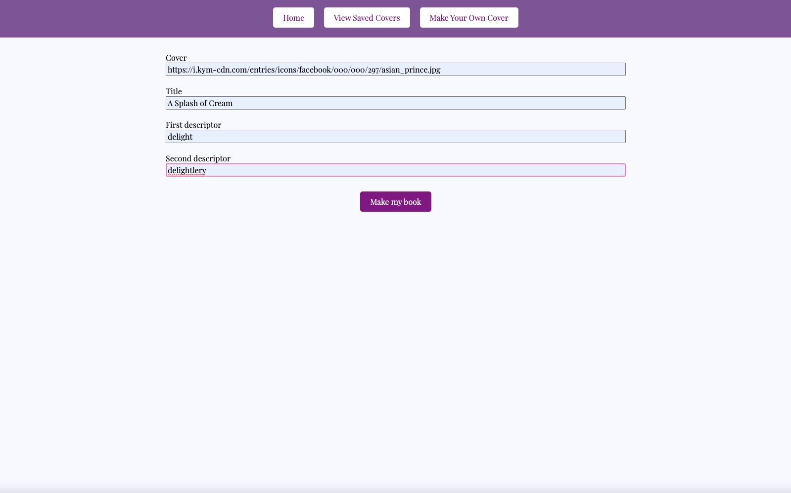
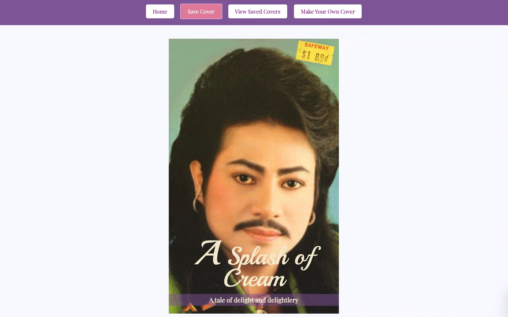
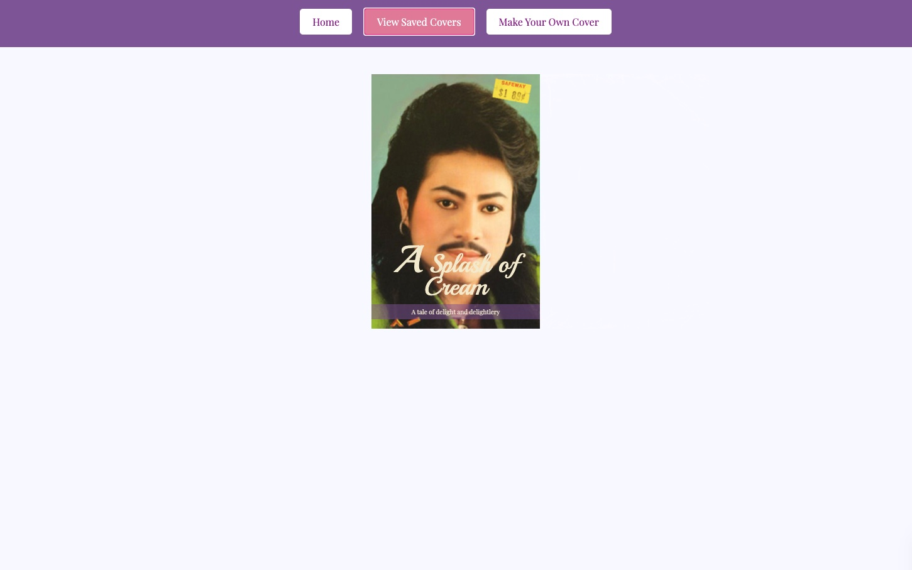

# Turing School of software design exercise
## Contributors
* Joel Thomas
* Charles Morris

## Technologies used:
* JavaScript
* CSS
* HTML

## Deploy link:
* [here](https://shakikka.github.io/romcom)

## How to Use:

* When In the Home View, You will see a randomly generated romantic novel cover with a price tag referencing the included files in ./assets folder.

* You may create more randomly generated covers using the `Show New Random Cover` button in the upper left of the page header.

* Click on `Make Your Own Cover` button in the upper right hand corner to create your own cover. Enter your own URL in the _*Cover*_ field to create a book using your own images.  Then enter your own title and descriptor information.

* Save your covers by clicking the `Save Cover button.`

* Feel free to hit the `Show New Random Cover` button. You might see a brand new surprise!                              

* You may view your saved covers at any time using the `View Saved Covers` button.

* If there is a cover in your `Saved Covers` display that you dislike, you can double click them to delete them!

* Be sure to have a great time with these covers!

### Future Additions
* When a user single clicks a saved cover, create a modal to view it larger
* Allow users to drag and drop saved posters into whatever order they want them to appear
* Add a price tag change
