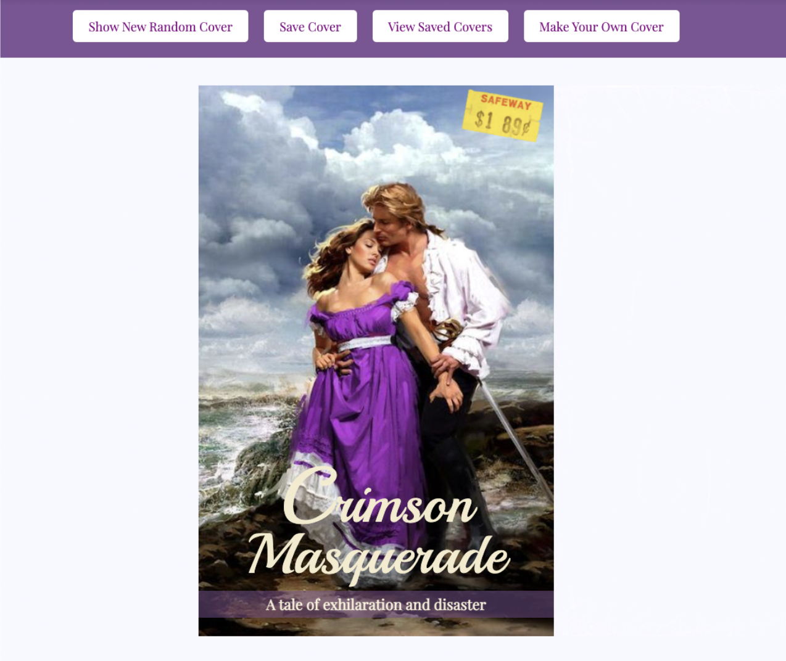
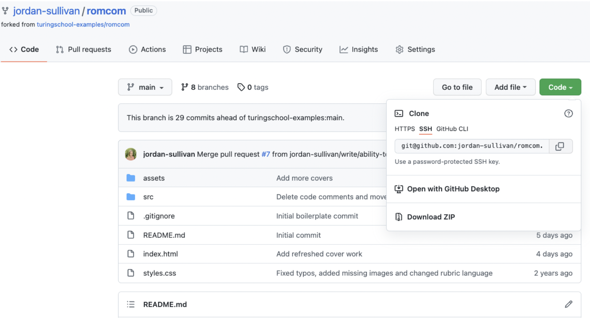
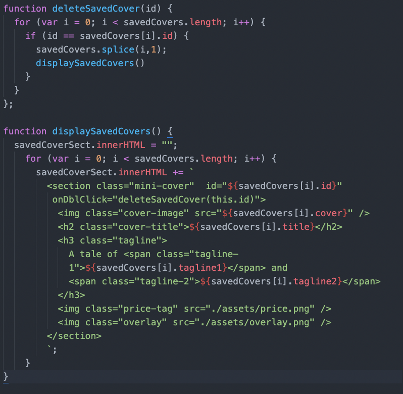
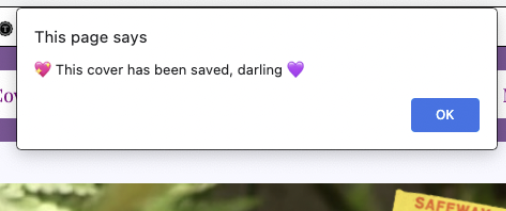

# **Create your Own RomCom**

This project allows users to flip through a random collection of Romance Novels with unique cover images, titles, and descriptions. The user can also create their very own cover by adding in their own fields to the text boxes! The program allows users to save covers they particularly like, and delete them with a simple double click.
This Valentine’s Day, users can have some fun with our Romance Novel generator to create the perfect book for their loved ones!

# **Contributors**

[Angele Williams](https://github.com/angelewilliams)

[Jordan Sullivan](https://github.com/jordan-sullivan)

# **Technologies Used**

- JavaScript
- HTML
- CSS

# **Local Set up Instructions**

- From the repo, click the code button and copy the SSH link.
  
- Open terminal by pressing command + space bar, and search for terminal
- Inside of you terminal type "git clone" and then paste the ssh link should look like git clone [git@github.com:jordan-sullivan/romcom.git](https://git@github.com:jordan-sullivan/romcom.git)
- In your terminal type "cd romcom"
- Then type "open index.html"
- The browser should then deploy.

# **Instructions For Use**

- Access the application by clicking on this deploy link: file:///Users/jordansullivan/turing/mod_1/projects/romcom/index.html
- On opening the browser, click through the buttons on the top of the screen to view Randomly generated Romance novels, save your favorites, view saved Covers, and make your own titles.
- When a user clicks on the _“Make your own cover”_ button, they should enter the correct properties into the fields. Note: the cover field should be a link ending in either a .png, .jpg file or .gif as shown below.
  
  Click the _“Make My Book”_ button below to see your unique book!

- If a user likes their creation, they may click on the _“Save cover”_ button to save to their favorites.
  
- To delete a cover, simply double click on the cover.
- A user may roam around the application as they please creating, generating, and saving/deleting Romance novel covers.

# **Code Architecture**

This project consists of 5 different files - cover.js, data.js, index.html, styles.css, main.js.

- cover.js is the class that holds the data model.
- data.js holds all necessary information for the applications logic including arrays of : Cover images, titles, and descriptors.
- Main.js houses our JavaScript functionality

# **Code Example**

We had a function called `displaySavedCovers`, and created another one called `deleteSavedCover` to be able to delete a cover on a doubleclick event. Our event listener, `ondblclick`, is embedded in our HTML Section because we want to view our saved covers in the console log in their own section with the ID displaying. In the Elements area of the console log, there is no button that lets us delete, so we are forced to make each saved cover have its own id and section to be able to delete upon double click .

# **Extra Features**

We want our users to be able to know their selection is saved when they click save, or has already been saved, so we created an alert for the user’s sanity for each action.

